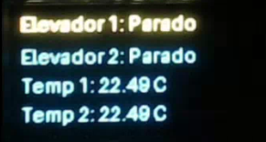
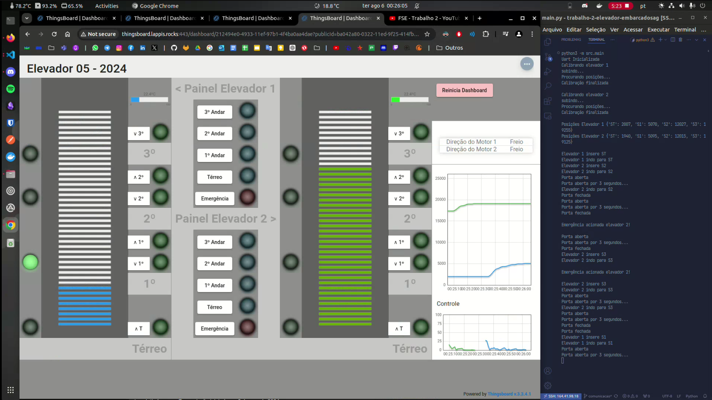
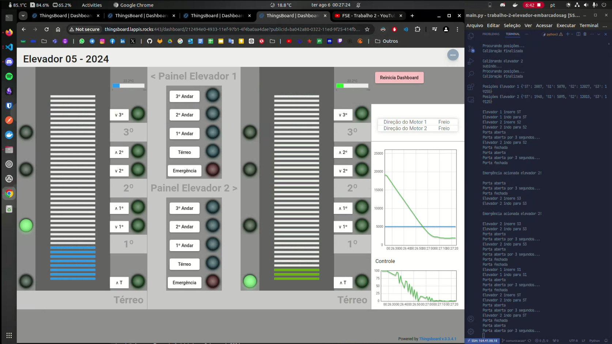
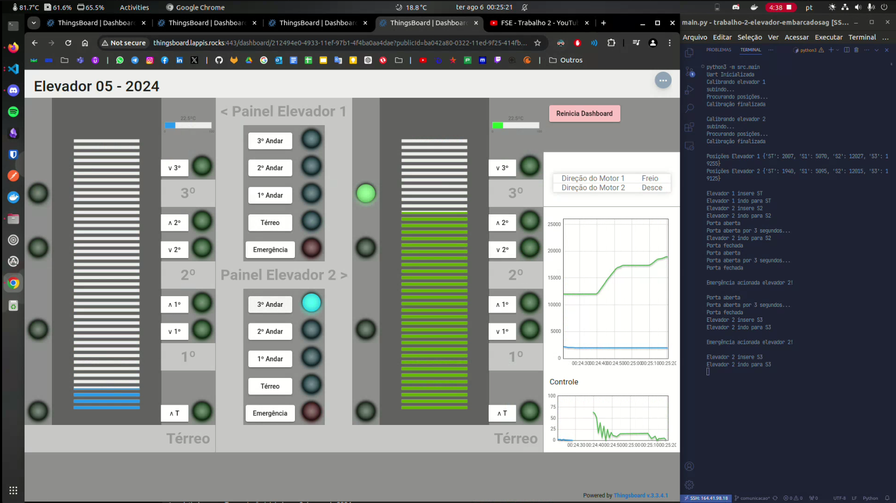

[](https://classroom.github.com/a/z3oDTWtZ)
[](https://classroom.github.com/open-in-codespaces?assignment_repo_id=15425936)

# Trabalho 2 - 2024.1
## Sistema de Gestão de Elevadores

O trabalho envolve o desenvolvimento do software que efetua o controle completo de um sistema de elevadores prediais incluindo o controle de movimentação, acionamento dos botões internos e externos e monitoramento de temperatura. O movimento dos elevadores é controlado à partir de motores elétricos e a posição é sinalizada à partir de sensores de posição e encoders.

### 👨‍💻 Contribuidores

<table>
  <tr>
    <td align="center"><a href="https://github.com/arthurgrandao"><br /><b>Arthur Grandão</b></a><br />Matrícula: 211039250</td>
    <td align="center"><a href="https://github.com/G16C"><br /><b>Gabriel Campello</b></a><br />Matrícula: 211039439</td>
  </tr>
</table>

## Sumário

- [Instalação](#instalação)
- [Uso](#uso)
- [Prints](#prints)
- [Apresentação](#apresentação)

## Instalação

### Requisitos

- [python3](https://www.python.org/), [pip](https://pypi.org/project/pip/), [git](https://git-scm.com/)
- Bibliotecas Python: `Adafruit-GPIO`, `Adafruit-PureIO`, `Adafruit-SSD1306`, `bmp280`, `future`, `i2cdevice`, `iso8601`, `pillow`, `pyserial`, `PyYAML`, `RPi.GPIO`, `smbus2`, `spidev`

### Passos de Execução

1. Clone o repositório:
```sh
https://github.com/FGA-FSE/trabalho-2-elevador-embarcadosag.git
```
2. Crie um ambiente virtual:
```sh
python3 -m venv myvenv
``` 
*O nome está como "myvenv" por causa do .gitignore

3. Ative o ambiente virtual
```sh
source myvenv/bin/activate
```

4. Instale as bibliotecas necessárias:
```sh
pip install -r requirements.txt
```

## Uso

1. Rode o projeto a partir diretório raiz:

```sh
python3 -m src.main
```
## Prints

### Tela OLED


### Movimento E1: Térreo -> Andar 1


### Movimento E2: Andar 3 -> Térreo


### Movimento E2: Andar 2 -> Emergencia -> Andar 3


## Apresentação

### [Link para a apresentação](https://youtu.be/AcSW0jPwJD8)
